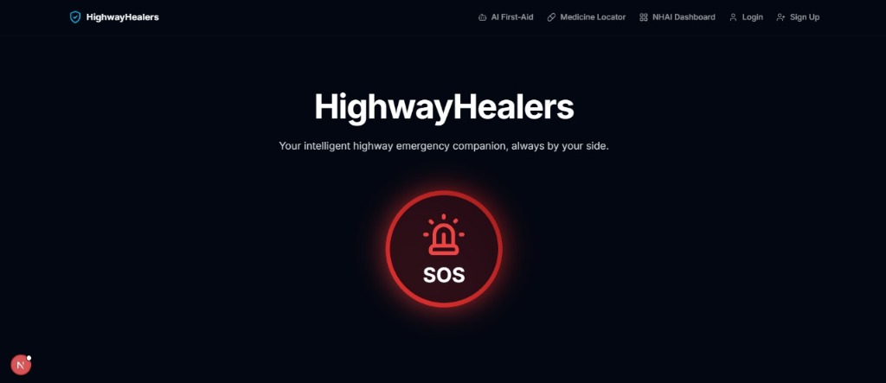
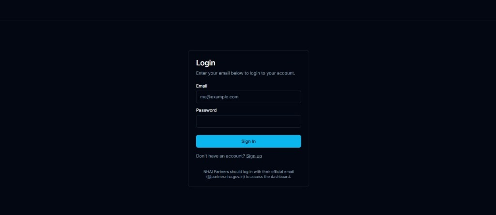
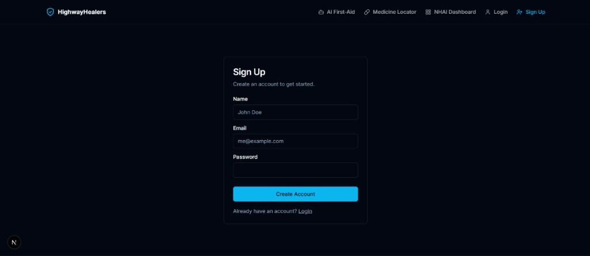
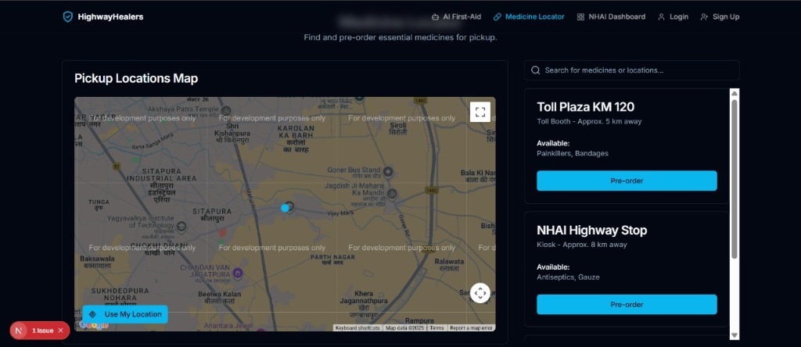
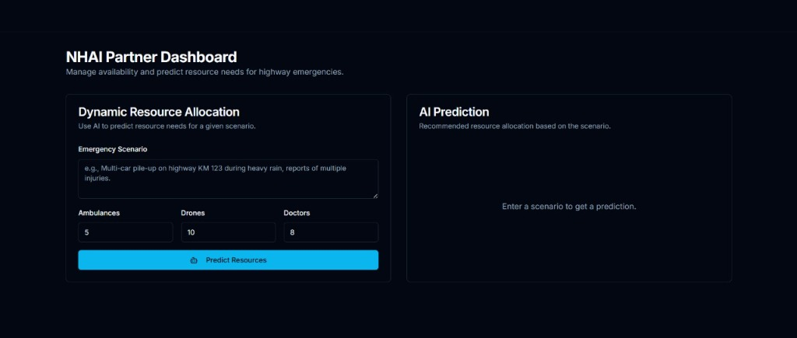

# 🚑 HighwayHealers

> **Your intelligent highway emergency companion — always by your side.**

HighwayHealers is an AI-powered highway emergency response platform built with **Next.js 15**, **Google Genkit**, and **Firebase**. It combines real-time geolocation, AI-driven first-aid guidance, medicine discovery, and smart resource allocation to provide a complete safety net for travellers on Indian highways.

---

## 📋 Table of Contents

- [Screenshots](#-screenshots)
- [Features](#-features)
- [Tech Stack](#-tech-stack)
- [Project Structure](#-project-structure)
- [Getting Started](#-getting-started)
- [Environment Variables](#-environment-variables)
- [Available Scripts](#-available-scripts)
- [AI Flows (Genkit)](#-ai-flows-genkit)
- [Pages & Routes](#-pages--routes)
- [Design System](#-design-system)
- [Deployment](#-deployment)
- [Contributing](#-contributing)
- [License](#-license)

---

## 📸 Screenshots

### Home — SOS Emergency Landing
> One-tap SOS button with animated hero section and quick-access navigation.



### Partner Login
> Secure login for NHAI-verified partners with email and password authentication.



### Partner Sign Up
> Quick registration for new partners — clinics, kiosks, and drivers.



### Medicine Locator
> Interactive map to find and pre-order essential medicines at nearby highway pickup points.



### NHAI Partner Dashboard
> AI-powered dynamic resource allocation — predict ambulance, drone, and doctor needs for any emergency scenario.



---

## ✨ Features

| Feature | Description |
|---|---|
| 🆘 **Instant SOS** | One-click SOS that acquires GPS location, dispatches ambulances & drones, and notifies an emergency contact via SMS |
| 🤖 **AI First-Aid Bot** | Powered by Google Gemini via Genkit — provides step-by-step first-aid instructions based on the user-described emergency |
| 💊 **Medicine Locator** | Search for medicines and find the nearest highway pickup points (toll booths, petrol pumps, kiosks) |
| 📊 **NHAI Dashboard** | AI-powered dynamic resource allocation — predict ambulance, drone, and doctor needs for any given emergency scenario |
| 📍 **Live ETA Tracking** | Real-time map with ETA for ambulance and drone delivery |
| 🔐 **Partner Login / Sign Up** | Secure portal for verified partners (clinics, kiosks, drivers) to manage availability |
| 📴 **Offline Fallback** | Automatic SMS/IVR fallback for areas with limited network coverage |

---

## 🛠 Tech Stack

| Category | Technology |
|---|---|
| **Framework** | [Next.js 15](https://nextjs.org/) (App Router, Turbopack) |
| **Language** | TypeScript 5 |
| **AI / LLM** | [Google Genkit](https://firebase.google.com/docs/genkit) + Google AI (Gemini) |
| **Styling** | Tailwind CSS v3 + `tailwindcss-animate` |
| **UI Components** | [shadcn/ui](https://ui.shadcn.com/) (Radix UI primitives) |
| **Animations** | [Framer Motion](https://www.framer-motion.com/) |
| **Maps** | `@vis.gl/react-google-maps` |
| **Forms** | React Hook Form + Zod validation |
| **SMS** | [Twilio](https://www.twilio.com/) |
| **Backend / Hosting** | [Firebase App Hosting](https://firebase.google.com/docs/app-hosting) |
| **Charts** | [Recharts](https://recharts.org/) |
| **Icons** | [Lucide React](https://lucide.dev/) |

---

## 📁 Project Structure

```
studio/
├── docs/
│   └── blueprint.md          # Original app design blueprint
├── src/
│   ├── ai/
│   │   ├── dev.ts            # Genkit dev server entry point
│   │   ├── genkit.ts         # Genkit AI instance configuration
│   │   └── flows/
│   │       ├── automated-first-aid-instructions.ts   # AI first-aid flow
│   │       ├── resource-allocation-prediction.ts     # AI resource allocation flow
│   │       ├── send-sms-flow.ts                      # Twilio SMS flow
│   │       └── sms-types.ts                          # SMS type definitions
│   ├── app/
│   │   ├── layout.tsx        # Root layout (Header, Toaster)
│   │   ├── page.tsx          # Landing page (Home)
│   │   ├── globals.css       # Global styles & Tailwind directives
│   │   ├── dashboard/        # NHAI resource allocation dashboard
│   │   ├── first-aid/        # AI First-Aid Bot page
│   │   ├── medicine/         # Medicine Locator page
│   │   ├── login/            # Partner login page
│   │   └── signup/           # Partner sign-up page
│   ├── components/
│   │   ├── assistance-bot.tsx       # AI First-Aid chat component
│   │   ├── emergency-modal.tsx      # SOS modal (contact → location → tracking)
│   │   ├── header.tsx               # Sticky navigation header
│   │   ├── map.tsx                  # Google Maps integration
│   │   ├── medicine-finder.tsx      # Medicine search component
│   │   ├── resource-allocator.tsx   # AI resource allocation form + output
│   │   ├── sos-button.tsx           # Pulsing SOS button
│   │   ├── icons/                   # Custom SVG icons (Drone, Ambulance, Logo)
│   │   └── ui/                      # shadcn/ui components
│   ├── hooks/
│   │   └── use-toast.ts      # Toast notification hook
│   └── lib/
│       └── utils.ts          # Utility functions (cn, etc.)
├── apphosting.yaml           # Firebase App Hosting configuration
├── components.json           # shadcn/ui configuration
├── next.config.ts            # Next.js configuration
├── tailwind.config.ts        # Tailwind CSS configuration
└── tsconfig.json             # TypeScript configuration
```

---

## 🚀 Getting Started

### Prerequisites

- **Node.js** >= 18.x
- **npm** >= 9.x
- A **Google AI API key** (for Genkit / Gemini)
- A **Twilio** account (for SMS alerts)
- A **Google Maps API key** (for the map component)

### 1. Clone the repository

```bash
git clone https://github.com/RISHIE2006/studio.git
cd studio
```

### 2. Install dependencies

```bash
npm install
```

### 3. Set up environment variables

Create a `.env.local` file in the root directory (see [Environment Variables](#-environment-variables) below).

### 4. Run the development server

```bash
npm run dev
```

Open [http://localhost:3000](http://localhost:3000) in your browser.

### 5. (Optional) Run the Genkit AI dev server

In a separate terminal:

```bash
npm run genkit:dev
```

This starts the Genkit developer UI at [http://localhost:4000](http://localhost:4000) where you can inspect and test AI flows.

---

## 🔑 Environment Variables

Create a `.env.local` file at the project root with the following variables:

```env
# Google AI (Gemini) — required for Genkit AI flows
GOOGLE_GENAI_API_KEY=your_google_ai_api_key

# Twilio — required for SOS SMS notifications
TWILIO_ACCOUNT_SID=your_twilio_account_sid
TWILIO_AUTH_TOKEN=your_twilio_auth_token
TWILIO_PHONE_NUMBER=your_twilio_phone_number

# Google Maps — required for the live map component
NEXT_PUBLIC_GOOGLE_MAPS_API_KEY=your_google_maps_api_key
```

> **Note:** Never commit `.env.local` to version control. It is already listed in `.gitignore`.

---

## 📜 Available Scripts

| Script | Description |
|---|---|
| `npm run dev` | Start the Next.js development server with Turbopack |
| `npm run build` | Build the production bundle |
| `npm run start` | Start the production server |
| `npm run lint` | Run ESLint across the project |
| `npm run typecheck` | Run TypeScript type checking without emitting files |
| `npm run genkit:dev` | Start the Genkit AI development server |
| `npm run genkit:watch` | Start Genkit with file watching (hot-reload for AI flows) |

---

## 🤖 AI Flows (Genkit)

HighwayHealers uses **Google Genkit** to orchestrate all AI interactions with Google Gemini. All flows live under `src/ai/flows/`.

### `automated-first-aid-instructions.ts`

- **Function:** `getFirstAidInstructions(input: FirstAidInput)`
- **Input:** `situationDescription` — a plain-text description of the emergency
- **Output:** `firstAidInstructions` — numbered, step-by-step guidance
- **Safety:** `HARM_CATEGORY_DANGEROUS_CONTENT` set to `BLOCK_NONE` to allow life-saving medical instructions

### `resource-allocation-prediction.ts`

- **Function:** `predictResourceAllocation(input)`
- **Input:** Emergency scenario description + available ambulances, drones, and doctors
- **Output:** `predictedAmbulanceNeed`, `predictedDroneNeed`, `predictedDoctorNeed`, `justification`

### `send-sms-flow.ts`

- **Function:** `sendSms(input: SmsInput)`
- **Input:** `to` (E.164 phone number), `message` (SMS body)
- **Output:** `{ success: boolean, sid?: string }`
- **Provider:** Twilio REST API

---

## 🗺 Pages & Routes

| Route | Page | Description |
|---|---|---|
| `/` | Home | Landing page with animated hero, feature cards, and the SOS button |
| `/first-aid` | AI First-Aid | Chat with the AI assistance bot for step-by-step first-aid |
| `/medicine` | Medicine Locator | Search for medicines and find nearby highway pickup points |
| `/dashboard` | NHAI Dashboard | Predict and allocate emergency resources using AI |
| `/login` | Partner Login | Login portal for verified partners |
| `/signup` | Partner Sign Up | Registration page for new partners |

---

## 🎨 Design System

HighwayHealers follows a **"Nighttime Highway"** design theme optimised for readability under stress.

| Token | Value | Purpose |
|---|---|---|
| Primary | `#FFB347` (Soft Orange) | CTAs, icons, active states |
| Background | `#293347` (Navy Blue) | Page backgrounds |
| Accent | `#76D7C4` (Hopeful Green) | Interactive highlights |
| Font | `Inter` (Google Fonts) | Clean, calm, highly readable |

- **Dark mode** enabled by default (`<html class="dark">`)
- **Framer Motion** micro-animations on page load and scroll-into-view
- **shadcn/ui** component library for consistent, accessible UI primitives
- Custom SVG icons for `Drone`, `Ambulance`, and the `Logo`

---

## 🚢 Deployment

This project is configured for **Firebase App Hosting**.

```bash
# Install the Firebase CLI (if not already installed)
npm install -g firebase-tools

# Log in to Firebase
firebase login

# Deploy
firebase deploy
```

The `apphosting.yaml` at the project root controls runtime configuration (e.g., `maxInstances`). Increase this value for higher traffic requirements.

---

## 🤝 Contributing

Contributions are welcome! Please follow these steps:

1. **Fork** the repository
2. **Create** a feature branch: `git checkout -b feature/your-feature-name`
3. **Commit** your changes: `git commit -m 'feat: add your feature'`
4. **Push** to the branch: `git push origin feature/your-feature-name`
5. **Open** a Pull Request

Please make sure `npm run lint` and `npm run typecheck` pass before submitting a PR.

---

## 📄 License

This project is licensed under the **MIT License**. See [LICENSE](LICENSE) for details.

---

<div align="center">
  Built with ❤️ for safer highways in India.
</div>
